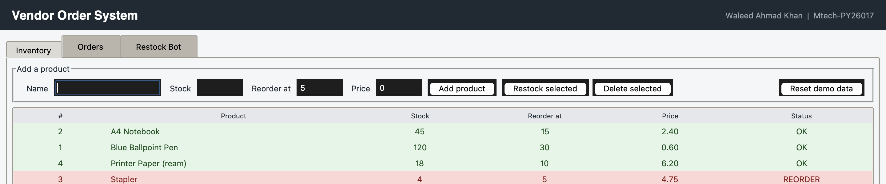
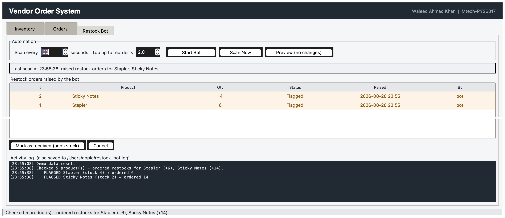
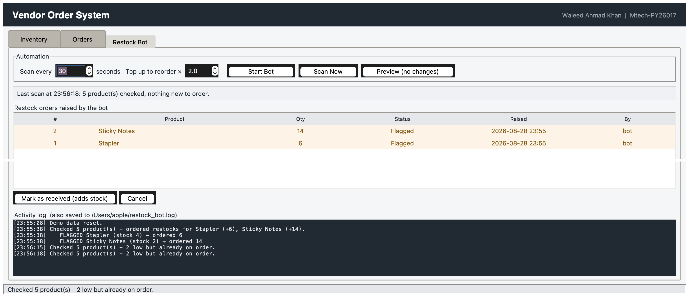

# Vendor Order System — Package + Automated Restock Bot

A **capstone** that packages the Week 4 Vendor Order backend together with the
Week 5 automation work, and puts the whole thing behind a single **Tkinter**
dashboard.

- **Intern:** Waleed Ahmad Khan
- **Reg No:** Mtech-PY26017
- **Concepts:** Capstone Integration
- **GUI Toolkit:** Tkinter
- **Level:** Advanced

---

## What this adds to Week 4

The Week 4 system could **tell** you something was running low. This one **acts
on it**.

An automated restock bot scans every product on a schedule, and for anything at
or below its reorder level it raises a restock order by itself — so the vendor
doesn't have to notice the problem first. The whole system is also now a proper
installable Python package rather than a folder of scripts.

| | Week 4 | This capstone |
|---|---|---|
| Low stock | Shown in a list | **Restock order raised automatically** |
| Running it | Two programs, two terminals | **One dashboard** |
| Distribution | Loose `.py` files | **`pip install`-able package** |
| Record of events | — | **Timestamped log file on disk** |

## How the bot decides

**How much to order.** Ordering just enough to reach the reorder level would
leave the product on the edge and it would be flagged again on the very next
scan. The bot tops up to a **target level** — the reorder level multiplied by a
factor (2 by default):

```
quantity = (reorder_level × factor) − current_stock
```

So a product that reorders at 10 with 4 in stock gets 16 ordered, not 6.

**Not ordering the same thing twice.** A restock order takes time to arrive.
Without a check, the bot would flag the same product on every scan and the
vendor would end up with a pile of duplicate orders. Before flagging anything
the bot looks for an outstanding order for that product and skips it if one
exists — the same *"act on a change of state, not on a condition"* idea used for
the Week 3 alerts.

**Logging.** Every scan and decision is written to `restock_bot.log` with
levels: `INFO` for a normal scan, `WARNING` when something is flagged, `ERROR`
if an order can't be raised.

```
2026-08-28 18:08:01 | WARNING | FLAG  Stapler - stock 4 at/below reorder level 5 -> ordered 6 (restock #1)
2026-08-28 18:08:01 | INFO    | SKIP  Stapler - already on order (restock #1)
2026-08-28 18:08:01 | INFO    | Scan complete - 5 product(s) checked, 0 flagged, 1 skipped
```

## What each week contributed

| Source | Used for |
|---|---|
| **Week 4 project** | The SQLite backend: products, orders, stock deduction, refusing to oversell |
| **Experiment 18** (Automation) | Scheduled scanning that acts without being asked |
| **Experiment 15** (Logging) | Levelled, timestamped log written to disk |
| **Experiment 20** (Packaging) | `src` layout, `pyproject.toml`, installable with `pip` |
| **Experiment 16** (Testing) | The 23-test pytest suite |
| **Experiment 14** (Threading) | The bot runs on a background timer; the GUI never freezes |
| **Experiment 13** (SQLite) | Parameterised queries throughout |

## The dashboard

Three tabs, one window:

- **Inventory** — add, restock and delete products; anything at or below its
  reorder level is highlighted red
- **Orders** — place customer orders; stock is deducted automatically and
  overselling is refused with a clear message
- **Restock Bot** — start/stop the bot, set the interval and target factor,
  see every restock order it has raised, mark deliveries as received, and watch
  a live activity log

There's also a **Preview** button that shows exactly what the bot *would* order
without changing anything.

## Requirements

- Python 3.8+
- Tkinter (bundled with Python; on macOS with Homebrew you may need
  `brew install python-tk`)

Everything else — `sqlite3`, `logging`, `threading`, `queue` — is standard
library. Flask is an optional extra only if you want the Week 4 web API as well.

## Install and run

**Straight from the folder:**

```bash
python run_dashboard.py
```

**Or install it properly:**

```bash
pip install .
vendor-dashboard
```

Installing registers a `vendor-dashboard` command, so the app can be launched
from anywhere. Sample data loads on first run, including two products already
below their reorder level, so the bot has something to find immediately.

## Project structure

```
vendor_order_system/
├── pyproject.toml                    # package metadata and build config
├── run_dashboard.py                  # run without installing
├── README.md
├── src/
│   └── vendor_system/
│       ├── __init__.py               # public API
│       ├── database.py               # all SQLite CRUD (from Week 4)
│       ├── restock_bot.py            # the automation logic
│       └── dashboard.py              # the Tkinter dashboard
├── tests/
│   └── test_vendor_system.py         # 23 pytest tests
├── screenshot1.png
├── screenshot2.png
└── screenshot3.png
```

The `src` layout means the tests run against the **installed** package, which
catches packaging mistakes before release.

## Screenshots

**The Inventory tab** — the Week 4 backend, with anything at or below its
reorder level highlighted red:



**The Restock Bot tab after a scan** — the bot has raised restock orders for
Stapler (+6) and Sticky Notes (+14) on its own, and logged each decision:



**Scanning again raises no duplicates** — the log reads *"2 low but already on
order"* and the list still holds only the two original orders:



## Running the tests

```bash
pip install pytest
pip install .
pytest
```

Expected: `23 passed`.

## Testing

All 23 tests pass, against both the source tree and the built wheel. They cover:

**The Week 4 backend** — orders deduct stock; overselling is refused and stock
is left unchanged; deleting an order returns its units; empty names are
rejected; a SQL-injection string leaves the table intact.

**The Week 5 automation** — the top-up quantity is calculated correctly; healthy
products are ignored; a scan flags exactly the low products; **a second scan
raises no duplicates**; a dry run changes nothing; receiving a restock adds the
stock; the same delivery can't be credited twice; a restocked product stops
being flagged; a cancelled order can be flagged again.

**The two together** — selling a healthy product down below its reorder level
causes the bot to order more on the next scan, and receiving that delivery
returns it to health. That full cycle is the point of the capstone.

The dashboard was then driven automatically to confirm the tabs populate,
orders deduct stock, overselling shows a warning, the preview writes nothing,
scans populate the restock list without duplicating, receiving adds stock, and
the bot starts and stops cleanly.

## Two bugs found by testing

**The same scan was logged twice.** The bot's callback already put its report on
the queue, and the dashboard was putting it on again. Fixed by letting the
callback do it alone.

**Repeating timers multiplied.** The method that drained the queue also
rescheduled itself, so calling it directly started a second loop — timers went
1, 2, 3. Fixed by separating "drain the queue" from "schedule the next poll".

Neither was visible from normal use; both were found by inspecting the log and
counting the pending timers.

## How I used AI

I used AI (Claude) as a learning and debugging aid — for example to understand
why a background thread must hand its results to Tkinter through a queue rather
than touching widgets directly, and why the bot must check for an outstanding
order before raising a new one. I reviewed and tested the logic myself; the
design decisions and final code are my own.
